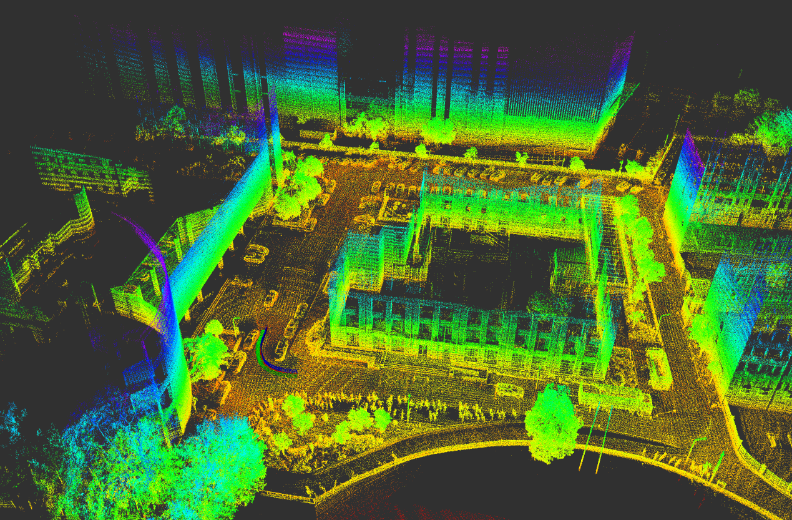
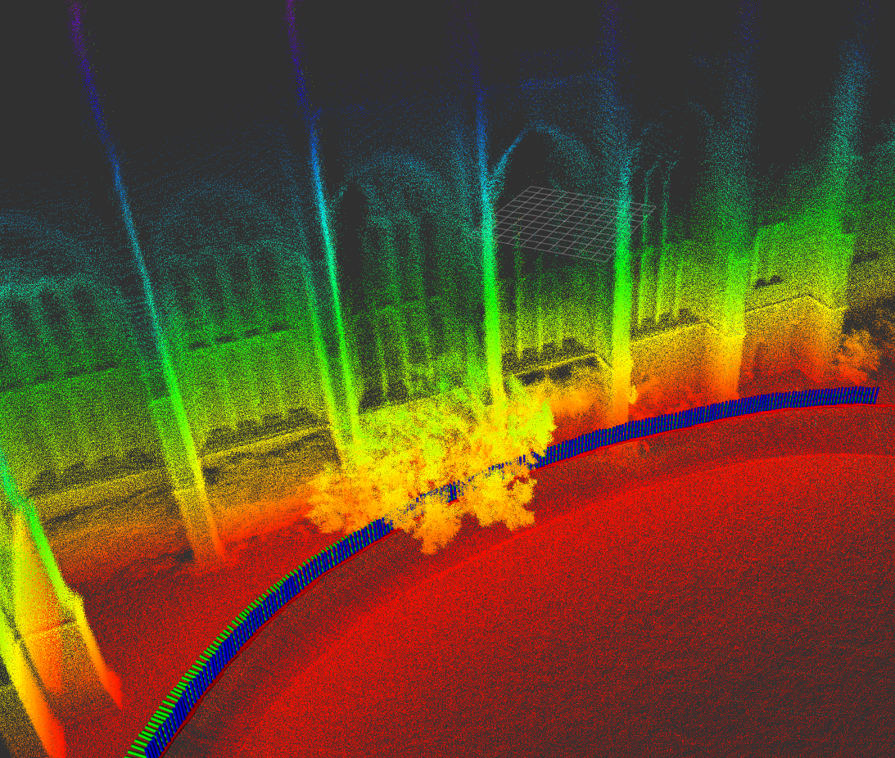

<h1 align="center"><a href="https://arxiv.org/abs/2509.20081" style="text-decoration:none;color:inherit;">G-EDF-Loc: 3D Continuous Gaussian Distance Field for Robust Gradient-Based 6DoF Localization</a></h1>

<div align="center">
  <a href="https://robotics-upo.github.io/G-EDF/"></a>
  &nbsp;
  <a href="https://arxiv.org/abs/2604.04525"></a>
</div>

 
**G-EDF-Loc** presents a robust 6-DoF localization framework based on a direct, CPU-based scan-to-map registration pipeline. This tool is part of a collaborative project and relies on the G-EDF (Gaussian Euclidean Distance Field) map representation.

> **⚠️ Important Prerequisite:** To use this localization system, you first need to generate a G-EDF map of your environment. The core mapping framework, detailed mathematical representation, and map generation tools are available in the **[G-EDF Mapping Repository](https://github.com/robotics-upo/G-EDF.git)**.

By leveraging this continuous and memory-efficient 3D distance field, the system avoids the matching ambiguities of raw point cloud registration and enables direct gradient-based optimization.

### Key features include:

- **G-EDF Map Integration & Precision:** Inherits centimeter-level accuracy by directly querying continuous distance values from the Gaussian representation. This mathematically consistent field provides stable, exact analytical Jacobians, which are crucial for reliable non-linear optimization.
- **Global C¹ Continuity:** Substitutes rigid discrete voxels with adaptively blended spatial blocks to ensure global C¹ continuity across transitions, mitigating the boundary artifacts and local minima that hinder standard grid-based methods.
- **Direct Gradient-Based Alignment & Efficiency:** Evaluates incoming scans directly against the map. By leveraging these exact gradients, the system achieves high CPU efficiency without the computational bottlenecks intrinsically tied to the quantity of points the model works with during each alignment step.
- **High Robustness:** Exhibits exceptional resilience and stable convergence even under severe odometry degradation or in the complete absence of IMU priors.

<p align="center">
  
  
</p>


## 1. Prerequisites

Before you begin, make sure you have **Ubuntu 22.04** and **ROS 2 Humble** installed on your system. If you haven't installed ROS 2 yet, follow the official [installation guide](https://docs.ros.org/en/humble/Installation.html).

Besides the standard ROS 2 packages, this project requires a few external C++ libraries. You can install most of them via `apt`:

```bash
sudo apt update
sudo apt install -y libpcl-dev libceres-dev libopencv-dev libgoogle-glog-dev
```

> **⚠️ Important - VDT Library:** > This project highly depends on the **VDT** math library for fast exponential computations. The CMake configuration explicitly looks for it in `/usr/local/include/vdt`. Make sure you have downloaded and installed VDT globally before building this package.

## 2. Installation

Once your prerequisites are satisfied, you can build the project within a standard ROS 2 workspace.

1. Create a workspace (if you don't have one) and clone the repository:
   ```bash
   mkdir -p ~/ros2_ws/src
   cd ~/ros2_ws/src
   git clone [https://github.com/robotics-upo/G-EDF-Loc.git](https://github.com/robotics-upo/G-EDF-Loc.git)
   ```

2. Navigate to the root of your workspace and build the package using `colcon`:
   ```bash
   cd ~/ros2_ws
   colcon build --symlink-install --packages-select g-edf-loc
   ```

3. Source the workspace to make the nodes available in your terminal:
   ```bash
   source install/setup.bash
   ```

## 3. Configuration

The localization node is highly configurable via ROS 2 parameters. You can pass these via a `YAML` file or command-line arguments.

### Node Parameters (`config.yaml`)

| Category | Parameter | Default | Description |
| :--- | :--- | :--- | :--- |
| **Frames & Topics** | `odom_frame` | `"odom"` | Reference frame for odometry |
| | `base_frame` | `"base_link"` | Base frame of the robot |
| | `lidar_topic` | `"/ouster_points"` | Input point cloud topic |
| | `imu_topic` | `"/imu_data"` | Input IMU topic |
| | `map_path` | `""` | Absolute path to the pre-built `.bin` G-EDF map |
| **Sensor Config** | `lidar_type` | `"ouster"` | LiDAR type (used to parse timestamps correctly) |
| | `timestamp_mode` | `"START_OF_SCAN"` | Timestamp reference mode |
| | `lidar_frequency` | `10.0` | LiDAR scan rate (Hz) |
| | `leaf_size` | `0.1` | Lidar scan downsampling resolution (m) |
| | `min_range` / `max_range` | `1.0` / `100.0` | Valid range bounds for LiDAR points (m) |
| | `calibration_time` | `1.0` | Initialization time before starting localization (s) |
| **IMU Settings** | `imu_frequency` | `100.0` | IMU publish rate (Hz) |
| | `use_fixed_imu_dt` | `true` | If false, computes exact `dt` between messages |
| | `gyr_dev` / `acc_dev` | `1.0` / `1.0` | Gyroscope and Accelerometer noise density |
| | `gyr_rw_dev` / `acc_rw_dev`| `1.0` / `1.0` | Gyroscope and Accelerometer random walk |
| **Solver Config** | `solver_max_iter` | `75` | Maximum Ceres optimization iterations |
| | `solver_num_threads` | `10` | OpenMP threads for optimization |
| | `robust_kernel_scale` | `1.0` | Scale parameter for the robust loss function |
| **Initial Pose** | `m_init_x`, `_y`, `_z` | `0.0` | Initial XYZ position (m) |
| | `m_init_roll`, `_pitch`, `_yaw` | `0.0` | Initial orientation (rad) |

### Sensor Transformations (TF)

When setting up your launch file, it is crucial to properly configure the static transformations (TFs) between your sensors and the robot's base frame (`base_link`).

* **Working with IMU (Standard / Noisy Nodes):** You must accurately broadcast the static TFs from both the LiDAR frame and the IMU frame to the `base_link`. The Error-State Kalman Filter (ESKF) relies heavily on these spatial relationships to correctly propagate the state and deskew the point clouds.
* **LiDAR-Only Setup (No IMU Node):** If you are running the system without inertial data, defining the exact TF to the `base_link` is less critical. In this scenario, the algorithm will simply estimate the pose and trajectory directly relative to the LiDAR sensor's own coordinate frame.

## 4. Usage & Execution

Once your parameters are correctly set in your configuration file (e.g., `config/lidar_localization_college.yaml`), you are ready to launch the system. 

By default, the launch file expects a standard sensor suite containing both **LiDAR and IMU** data to feed the state estimator for robust propagation and point cloud deskewing.

To run the default localization node:
```bash
ros2 launch localization localization.launch.py
```

### Running Without IMU
If your robotic platform does not have an IMU, or you want to evaluate the system relying solely on the LiDAR scan-to-map registration, you can bypass the IMU dependency entirely. Just append the `mode:=no_imu` flag to your launch command:

```bash
ros2 launch localization localization.launch.py mode:=no_imu
```

### Important Notes on the Launch File
* **Static Transforms (TF):** The provided launch file includes several `static_transform_publisher` nodes that define the spatial relationship between your sensor frames (e.g., `os_sensor`, `os_imu`, `PandarXT-32`) and the robot's `base_link`. **Make sure to edit these translation and quaternion values** in the launch file to match the physical calibration of your specific robot or dataset.
* **Visualization:** RViz is launched automatically by default. You can easily disable it by appending `rviz:=false` to your launch command.

## 5. Output Data & Logging

During execution, the localization node automatically logs the estimated vehicle state and computational performance metrics into two separate files. These are extremely useful for trajectory evaluation and real-time performance analysis.

### Estimated Trajectory (`predict_data.csv`)
This file records the continuous 15-DoF state estimation (pose, velocities, and IMU biases). The CSV follows a standard format compatible with most trajectory evaluation tools (like `evo`):

```csv
time,field.header.seq,field.header.stamp,field.pose.pose.position.x,field.pose.pose.position.y,field.pose.pose.position.z,field.pose.pose.orientation.x,field.pose.pose.orientation.y,field.pose.pose.orientation.z,field.pose.pose.orientation.w,field.twist.twist.linear.x,field.twist.twist.linear.y,field.twist.twist.linear.z,field.twist.twist.angular.x,field.twist.twist.angular.y,field.twist.twist.angular.z,gbx,gby,gbz,abx,aby,abz
```

### Performance Metrics (`execution_times.txt`)
This file provides a detailed breakdown of the computational cost per scan, tracking both the processing time (in milliseconds) and the point cloud statistics fed into the Ceres optimizer:

```text
Deskew,Downsample,Optimization,Total,OriginalPoints,DownsampledPoints,Iterations
```
* **Deskew / Downsample / Optimization / Total:** Execution time breakdown for each pipeline stage.
* **OriginalPoints / DownsampledPoints:** Tracks the point reduction.
* **Iterations:** Number of steps the Ceres solver took to converge for that specific scan.


## Acknowledgements


This work was supported by the grants PICRA 4.0 (PLEC2023-010353), funded by the Spanish Ministry of Science and Innovation and the Spanish Research Agency (MCIN/AEI/10.13039/501100011033); and COBUILD (PID2024-161069OB-C31), funded by the Spanish Ministry of Science, Innovation and Universities, the Spanish Research Agency (MICIU/AEI/10.13039/501100011033) and the European Regional Development Fund (FEDER, UE).
